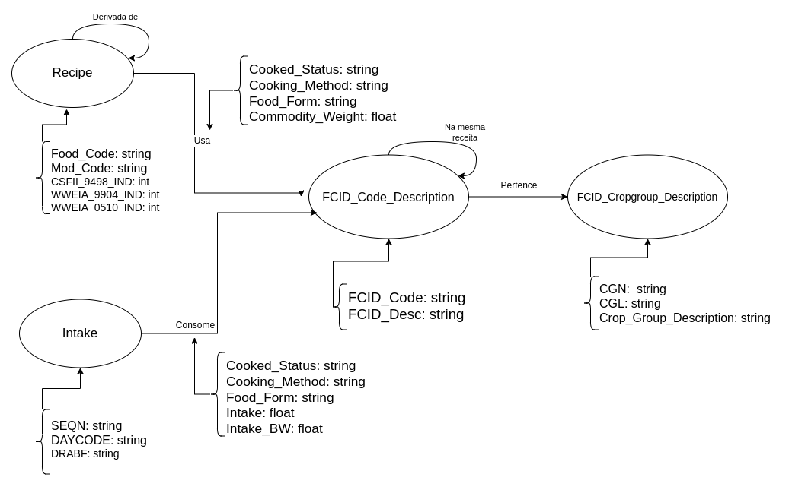

# Equipe VIRUS

# Subgrupo B
* Guilhermo de Luiggi Mocelim de Oliveira - 223325
* Luiz Fernando Lima Leite - 248405
* Sara Beatriz da Silva Oliveira - 231288

## Modelo Lógico para Banco de Dados de Grafos

## Perguntas
* Quais alimentos são mais consumidos juntos?
* Quais as comidas mais populares?
* Quais os grupos de alimentos mais populares?
* Qual a média de consumo de cada alimento?
* Qual versão de cada receita é a mais consumida?

