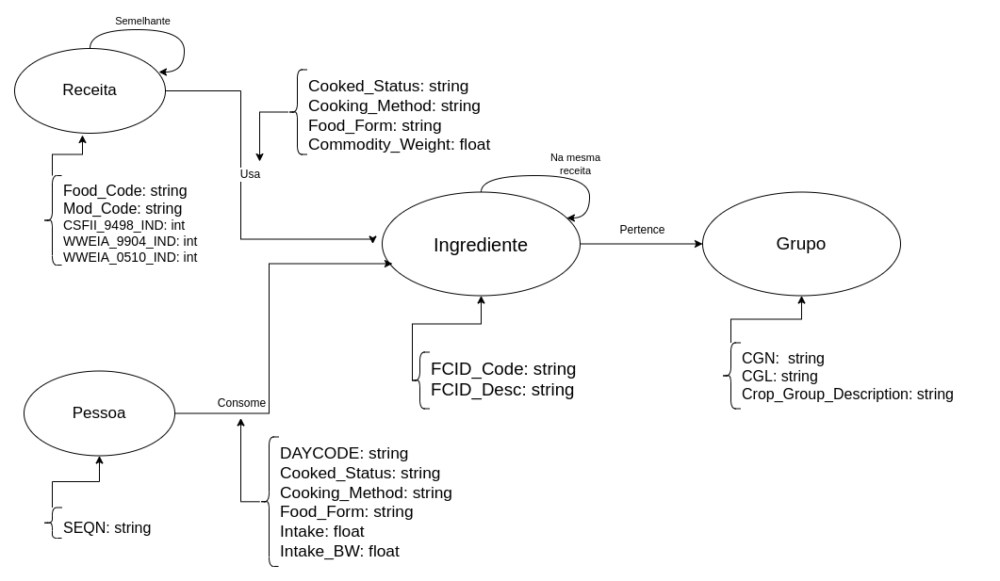

# Equipe VIRUS

# Subgrupo B
* Guilhermo de Luiggi Mocelim de Oliveira - 223325
* Luiz Fernando Lima Leite - 248405
* Sara Beatriz da Silva Oliveira - 231288

## Modelo Lógico para Banco de Dados de Grafos

## Perguntas de Pesquisa/Análise
* Suponha que um indivíduo goste de uma Receita A. Quais outras Receitas podemos recomendar a ele?
* Dado um ingrediente, quais outros alimentos poderíamos combinar para gerar novas receitas?
* Quais alimentos são mais consumidos juntos?
* Quais são os ingredientes mais populares?